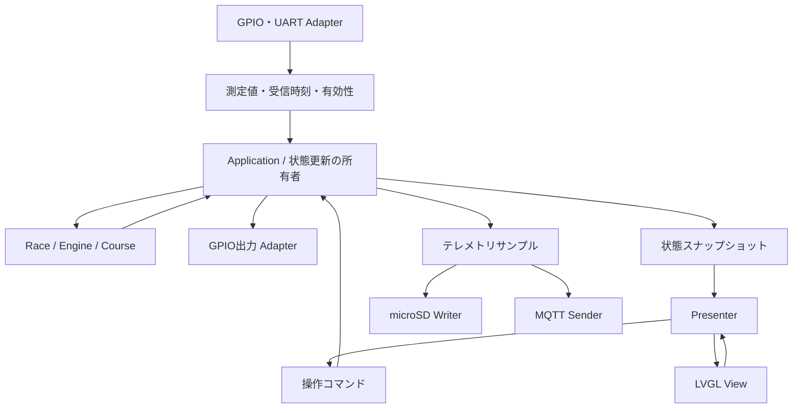

# Delta Vega v2 ソフトウェア設計

作成日: 2026-09-28

状態: Ports and Adapters＋MVPで初期実装。実装・設定・検証の詳細は[firmware-guide.md](firmware-guide.md)を参照。外部センサー・車両・AWS・画面目視の実検証は別途行う。

表示・操作の仕様は[ui-spec.md](ui-spec.md)、レイアウトの編集元は`eez/delta-vega-v2.eez-project`。本書は責務・依存関係・入出力の契約を扱う。

## 1. 初期実装の要件

| 項目 | 合意内容 |
|---|---|
| 車速 | Tab5がM5Bus GPIOからリードスイッチを直接取得。車輪周長1.03 m、1回転1パルス |
| GPS | GT-502MGG-NをM5Bus経由のUARTへ接続 |
| 平均速度 | 計測開始後の車輪パルス積算距離÷計測経過時間。停止時間を含む |
| 開始 | ドライバーのSTART TIMING操作。開始時に1/7、経過0。GPSによる自動開始はしない |
| 周回 | 周回更新地点の有効通過または手動補正で進める。6回更新して7/7となる |
| 完走 | 7周目のゴール地点通過。スタート・周回更新・ゴールは別地点 |
| 取消 | 完走前に取消可能。開始待ちへ戻り手動開始でやり直せる。完走後の再計測機能は不要 |
| TARGET | 全体42:00、1〜7周目は各06:00を暫定採用。Settingsで編集し、計測中は変更禁止 |
| 大会制限 | ユーザー申告で39:16以内。暫定TARGET42:00とは区別する |
| 電装 | エンジン系電装のみON/OFF。Tab5・車速・GPSはOFFでも動作継続。初期HIGH=ON、LOW=OFF |
| 起動・再起動 | 電装OFF・始動パルスLOW。明示的なONまで維持し、以前のON状態を復元しない |
| ECU準備待ち | 電装ON後、暫定1000 ms。待機中は点火操作無効 |
| 始動 | ECUへ1本のLOW→HIGH→LOWパルス。HIGHは暫定1000 ms。電装ONごとに1回まで |
| エンジン動作 | 始動後の動作・自動停止は車両側が担当。Tab5による早期停止は電装OFFのみ |
| 状態応答 | 電装・エンジンの実状態を確認する信号なし。指令状態を実状態と混同しない |
| MQTT | 初期は旧版のAWS IoT接続・トピック・項目・500 ms周期を引き継ぐ。改善に伴う変更は可能 |
| microSD | 計測中のみ保存、必須。項目はMQTTに倣う。未挿入・書込失敗は警告して計測継続 |
| 初期範囲外 | 通信断中データの自動後送信、再起動後の計測復元。AWSでの走行プラン解析・受信は将来機能 |

### 初期地点設定

| 地点 | 緯度 | 経度 | 意味 |
|---|---:|---:|---|
| スタート | 36.530654 | 140.227998 | 開始位置の確認用。開始操作の自動化・位置による開始禁止を意味しない |
| 周回更新 | 36.532766 | 140.226269 | 周回更新用 |
| ゴール | 36.534443 | 140.225411 | 7周目のみ完走判定 |

地点はユーザー指定の近似値であり、Settingsから変更可能とする。座標・TARGET・車輪定数・GPIO極性・ECU待ち時間・パルス時間を設定データに集約し、処理や生成UIに分散して埋め込まない。Settingsの基本画面にはTARGETと3地点、Advanced Settingsには車輪・GPS・周回判定・ECU関連の13項目を置く。

## 2. 責務と依存関係

| 境界 | 責務 | 依存先 |
|---|---|---|
| Domain | 計時・周回・距離・通過判定・電装と始動指令の状態遷移 | C++標準の型と内部の値型 |
| Application | 入力・操作を受理し、Domainを更新。機器指令・設定保存・ログの開始終了を調整 | Domain、Ports |
| Ports | 時計、出力、保存、送信など外部との契約 | 内部の値型 |
| Presenter | 状態スナップショットを表示モデルへ変換。View操作をApplicationのコマンドへ変換 | 表示モデル、View契約、操作受付契約 |
| Adapters | GPIO割り込み、UART/NMEA、LVGL、SD、NVS、Wi-Fi/MQTT、NTPの具体処理 | 内部の契約、各SDK |
| Composition | 具体オブジェクトを生成して接続。起動順序とタスクを構成 | 各構成要素 |

Domain・Application・PresenterからArduino、ESP-IDF、FreeRTOS、LVGL、M5Unified、MQTTのヘッダーを参照しない。具体的なSDK型・GPIO番号・LVGLオブジェクトはAdapter側に閉じ込める。Presenterは抽象Viewを通して表示し、LVGL ViewだけがEEZの`objects`を参照する。

走行戦略はmicroSD Adapterが起動時に読み、Domainの検証済み値型をUIへ渡す。Presenterは現在周回と有効な経路上の進行距離から次のON/OFF案内を作り、LVGL Viewはモックと同じ地図色・マーカーで描画する。表示用の現在位置投影と、周回経路上の距離投影は分けて保持する。走行戦略から電装・点火の出力Portは呼ばない。

外部と差し替える境界に必要なインターフェースを置く。Domain内部は値型と具体クラスで構成する。依存は起動処理で明示的に渡し、グローバルなサービス検索機構を設けない。

### 実行時の流れ



図は実行時のデータ経路であり、ヘッダーの依存関係ではない。具体Adapterが内側の契約を実装する。

## 3. ファイル配置

```text
lib/vega_core/src/
  domain/             RaceSession, EngineCommands, Course, PassageDetector, NMEA
  application/        Application, MQTT/SD共通JSONエンコーダ
  ports/              時計・出力・設定・ログ・送信・コマンドの抽象契約
  presentation/       Presenter, 表示モデル, Settings入力の検証
src/
  main.cpp            起動とUI loop
  app/ui_navigation.cpp  EEZナビゲーションのネイティブアクション
  adapters/
    tab5_runtime.*    GPIO・UART・NVS・SD・MQTT/NTP・タスク構成
    lvgl_view.*       LVGL View・生成オブジェクト・編集操作
  ui/                 EEZ生成物
  tab5_lvgl.*         M5ディスプレイ・タッチとLVGLの接続
variants/m5tab5/       Tab5専用Arduinoピン定義
include/config/       通信設定例（秘密情報はGit除外）
scripts/              nativeテスト、EEZ再生成、コース定数生成
assets/
  course_catalog.*    収録コースの登録とコース別の初期設定
  <course>/            コースJSON・画像・生成済み定数
test/native/          中核のテスト
```

`src/app/ui_navigation.cpp`はナビゲーション専用Adapterとして残し、設定初期化と復帰先の決定はLVGL Viewへ委譲する。EEZの生成先`src/ui/`とネイティブアクションの接続は維持する。生成コードは編集しない。現行10ダッシュボードは状態例であり、実機の状態はレース・GPS・通信・電装の組み合わせとして管理する。表示ページとアプリ状態を1対1の巨大な列挙にしない。

## 4. 状態と時間

### レース

`Waiting → Measuring → Finished`。`Measuring → Waiting`が取消。取消と完走は別の終了理由を持つ。取消前のログを保持し、新たな開始では別の計測として区別する。

開始時のパルス総数を基準に距離を積算する。平均速度用距離は平滑化した車速の時間積分で代用しない。レース開始前のパルスは計測距離へ含めない。

レース経過は単調増加時刻と開始時刻との差、ラップ経過はラップ開始時刻との差で算出する。表示周期を経過時間に加算しない。時刻は64 bitで扱い、壁時計（NTP/RTC/GPS時刻）と区別する。完走時の結果は保持する。

周回更新とゴールは別の通過検出器で扱い、ゴールは7周目の有効通過のみ受理する。自動・手動ラップは共通の操作受付へ渡し、同一通過の二重反映を抑制する。7/7では周回更新によって8/7や完走へ進めない。

### 電装・始動指令

| 状態 | 電装出力 | 始動出力 | 点火操作 |
|---|---|---|---|
| Off | LOW | LOW | 無効 |
| Preparing | HIGH | LOW | 無効。暫定1000 ms待つ |
| Ready | HIGH | LOW | 有効 |
| Pulsing | HIGH | HIGH | 無効。暫定1000 msでLOWへ戻す |
| Issued | HIGH | LOW | 無効。電装OFF→ONまで保持 |

この状態は指令状態であり、エンジン実運転状態ではない。始動操作を受理した時点で、その電装ONサイクルの始動権を消費する。UIの無効化に加えてApplicationでも重複を拒否する。

電装OFFは待ち・パルスを解除し、電装を設定極性のOFFレベル、始動をLOWにする。以前の電装サイクルの遅延したタイマー通知が、新しいパルスを短縮しないよう現在の期限と照合する。待ちやパルスにブロッキングのdelayを使わない。出力期限の処理はUI描画・SD・ネットワークから独立させる。

レースと電装の状態は独立する。電装OFFでレースを取消しない。計測取消の操作も電装OFF操作とは分ける。

### 設定

設定保存は版付きSettingsをNVS blobとして行う。型・範囲・版を検証し、開始時に計測用設定のスナップショットを固定する。計測中の変更はApplicationで拒否する。電装ON状態や始動権は永続設定として復元しない。全体TARGETと各周TARGETは独立して保存し、合計一致を強制しない。Settingsは数値キーボードによるMM:SS/H:MM:SSと十進座標の編集を行う。電装極性・待ち時間・パルス時間の変更は電装OFF時に限る。

## 5. データと並行処理

### データの扱い

- GPSは緯度経度、測位状態、受信単調時刻、利用可能ならGPS時刻・進行方向を一つの測定値で渡す。緯度経度は解析段階からdouble精度を保つ。
- パルスは変化したかどうかではなく実際の差分・累積数を保持する。リードスイッチのチャタリング処理と表示LEDの点灯延長は別処理とする。
- 値の有効性、最終更新時刻、順序番号を保持する。停止中の有効な0と、未取得・古い値を区別する。
- GPS通過判定用の位置列は時系列で処理する。表示用の最新位置へ上書きする経路とは区別し、欠落時に通過を確定したと偽らない。
- UIと通信は同じ確定済み状態から生成する。共有された可変フィールドを個別に読み集めない。

### 実行文脈

- Applicationの状態更新は一つの実行文脈が所有する。
- LVGL操作はUI文脈だけで実行する。Presenterの操作受付はコマンド送信でつなぎ、UIからDomain状態を直接変更しない。
- UART受信、SD書込、ネットワークなど待ちが発生する処理を分離する。SDK内蔵タスクも含め、タスク数・優先度・スタック量は負荷計測で決める。
- 表示用スナップショットはコピーとして受け渡し、操作イベントは順序を保つ有限キューを使う。
- キュー満杯時の扱いを定義する。ログ欠落・操作拒否・入力欠落を黙って成功扱いにしない。SDやMQTTの遅延で計測・電装OFFを待たせない。
- Wi-Fi接続完了を待たずに画面・センサー・計測機能を起動する。

## 6. GPIO割り当て

| 用途 | GPIO | M5Bus端子 | 接続 |
|---|---:|---:|---|
| 車速パルス | 16 | 2 | 入力。リードスイッチの入力回路・チャタリング対策は別途検証 |
| GPS RX | 7 | 15 | GPS TX → Tab5 RX |
| GPS TX | 6 | 16 | Tab5 TX → GPS RX |
| 電装出力 | 45 | 8 | 初期HIGH=ON、LOW=OFF |
| ECU始動 | 48 | 22 | HIGHパルス。通常LOW |

UART1をGPIO7/6へ割り当てる。GPIO6/7はSTAMP拡張とも共有するため、GPS用に占有する。GPIO37/38等のストラップ端子と内蔵I²C・SD・無線用端子を避ける。端子番号はGPIO番号とは別であり、実配線時はコネクタの向きも照合する。

電装・始動のGPIOは絶縁回路を介してハーネスへ接続する。出力未駆動・リセット中も電装OFFとなる回路条件を満たす。回路の極性とECUの待ち・パルス時間は暫定値で、実機接続前に確認する。GPSの電源電圧とUART信号レベルは別に確認する。

根拠: [Tab5 PinMap](https://docs.m5stack.com/en/core/Tab5)、[Tab5回路図](https://m5stack-doc.oss-cn-shenzhen.aliyuncs.com/1132/Tab5_Schematics_PDF.pdf)、[ESP32-P4 GPIO](https://docs.espressif.com/projects/esp-idf/en/stable/esp32p4/api-reference/peripherals/gpio.html)、[GPS製品](https://akizukidenshi.com/catalog/g/g117980/)。現行M5UnifiedのTab5用M5Bus・UARTピン表とも照合済み。GPS初期設定は製品の9600 bps・NMEA・1 Hzを出発点とし、実機出力とコマンド仕様を確認する。

## 7. MQTTとmicroSD

旧版の調査対象は`Siroyan/delta-vega`のdev、`f7caaee`。初期互換対象は以下とする。

- AWS IoTへMQTT over TLS、クライアント証明書認証。
- トピック: `v0/delta_machine_alpha/telemetry/racing_data`。
- 送信周期: 計測中500 ms、QoS 0。
- 項目: `speed`、`average_speed`、`lap_number`、`total_time_ms`、`lap_time_ms`、`latitude`、`longitude`、`timestamp_ms`、`machine_id`、`memo`。
- `timestamp_ms`は旧版では起動後の経過msであり、UTC時刻ではない。レース経過とは別。

接続先・機体ID・メタデータはAdapterの設定に集約する。将来の壁時計・有効性・セッションIDの追加は契約の版管理を伴う変更として扱う。未取得の車速・平均速度と無効・古いGPS座標はJSON nullとする。旧consumerのnull対応はAWS接続検証時に確認する。

計測中の同じテレメトリサンプルをSD保存とMQTT送信へ渡す。SDはMQTT接続状態に関係なく記録し、通信断の自動後送信は初期実装に含めない。

保存形式はJSON Linesで、テレメトリ1サンプルを1行にする。計測ごとにファイルを分け、設定・開始終了理由・取消・補正・制御操作は別のメタデータ／イベント記録で識別できるようにする。開始で記録を開き、完走または取消で終了する。取消データを削除しない。

SD未挿入・書込失敗・ログキューあふれを警告する。記録失敗で計測・制御・UIを停止しない。flush/fsyncは1秒周期および終了時。POSIXの戻り値を確認し、書込・同期失敗を警告する。キューは48件、500 msサンプルで約24秒分（イベント数で減少）。再起動後の計測復元を実装していない段階では、ログ保存だけでレース復元ができるとは扱わない。

## 8. 検証と実装順序

1. Domain・Applicationの状態遷移と設定値を実装し、native環境で検証する。
2. Fake時計・入力・出力・保存・Viewを使い、Presenterと既存UIを接続する。
3. パルス・GPSの実入力、座標変換、通過判定を接続・校正する。
4. 電装・ECUパルス、Settings編集、計測取消を接続する。
5. microSD・旧版互換MQTT・NTPを接続し、遅延・障害時の継続を検証する。

初期実装に必要な検証:

- 手動開始でラップ完了が加算されず、6回更新後の7周目ゴールのみで完走する。
- 方向違い・GPS欠損・同じ通過の手動と自動・連打で周回を誤加算しない。
- 距離積算、停止を含む平均速度、ラップと全体時間の独立性、時刻補正の影響を検証する。
- ECU準備待ちとパルス期限、電装ONごとの1回制限、途中OFF、以前のタイマーの遅延通知を検証する。
- 計測中の設定変更拒否、取消からのやり直し、完走結果保持を検証する。
- SD・MQTTの切断や遅延でも画面・時間・パルス計測・電装OFFが継続する。
- EEZ再生成後もPresenter/View接続とネイティブアクションが保たれる。
- 実機で入力信号・GPIO出力波形・リセット中の回路状態・SD書込遅延を確認する。

GPS判定の幅・方向・鮮度・重複抑制、リードスイッチの入力回路とチャタリング閾値、NTP同期条件、ログflush周期は実機・ログによる技術的な検証事項として残す。値が未確定のまま検証済みと扱わない。

## 9. 実装時に確定した構成

- Applicationタスク（優先度4）が10 ms周期で状態を所有し、GPS受信順に処理する。UIは約100 ms周期でスナップショットを描画する。SD・Networkは別タスク（優先度1）。
- 電装OFFは専用の要求フラグで優先処理し、それ以前に蓄積した操作を破棄する。始動GPIOはesp_timerからも期限でLOWへ戻す。遅延した旧タイマー通知は新しい期限を短縮しない。
- SDは4 bit / 20 MHz / LDO4。M5UnifiedがIOエキスパンダのカード電源を有効にする。汎用EV BoardのGPIO45 SD電源制御はTab5に不適合のため、専用variantを追加した。Wi-Fi内部SDIOは12/13/11/10/9/8、リセット15。
- 初期範囲ではSDK側Adapterを2組のファイルに集約した。Domain/Portsの境界とI/Oタスクは独立し、機能拡大時にAdapterを分割できる。
- 初期GPS閾値・入力校正・NTP/HOLDOVER条件・ログ名と形式は[firmware-guide.md](firmware-guide.md)にまとめる。技術的な推測を設定へ集約している。
